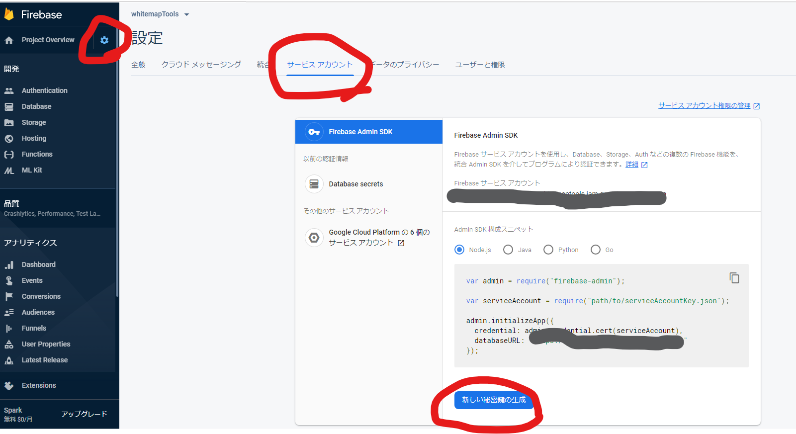

## 認証

秘密鍵の登録


認証用のテーブル作成

```
php artisan make:migration create_users_table --create=users
```

編集し終わったら、マイグレーションでテーブルを作る。

laradock/.env を確認して、whitemap/.env に DB 設定を記述する。

```
DB_CONNECTION=mysql
DB_HOST=mysql
DB_PORT=3306
DB_DATABASE=<laradockで決めたもの>
DB_USERNAME=<laradockで決めたもの>
DB_PASSWORD=<laradockで決めたもの>
```

### パスポートの導入

```
composer require laravel/passport
```

```
$ composer require laravel/passport
$ php artisan migrate
$ php artisan passport:install
```

#### 試す

```
php artisan make:controller User --api
```

## 認証・認可

[面倒なログイン機能の実装は Firebase Authentication に丸投げしよう](https://www.apps-gcp.com/firebase-authentication/)
[firebase ui](https://github.com/firebase/firebaseui-web)
[Guard](https://qiita.com/fagai/items/a70c937ab7cf72f19dc2)
[【PHP】新 TwitterOAuth でログイン機能を実装する](https://qiita.com/sofpyon/items/982fe3a9ccebd8702867)
[Firebase Admin SDK for PHP Authentication](https://firebase-php.readthedocs.io/en/latest/authentication.html)
