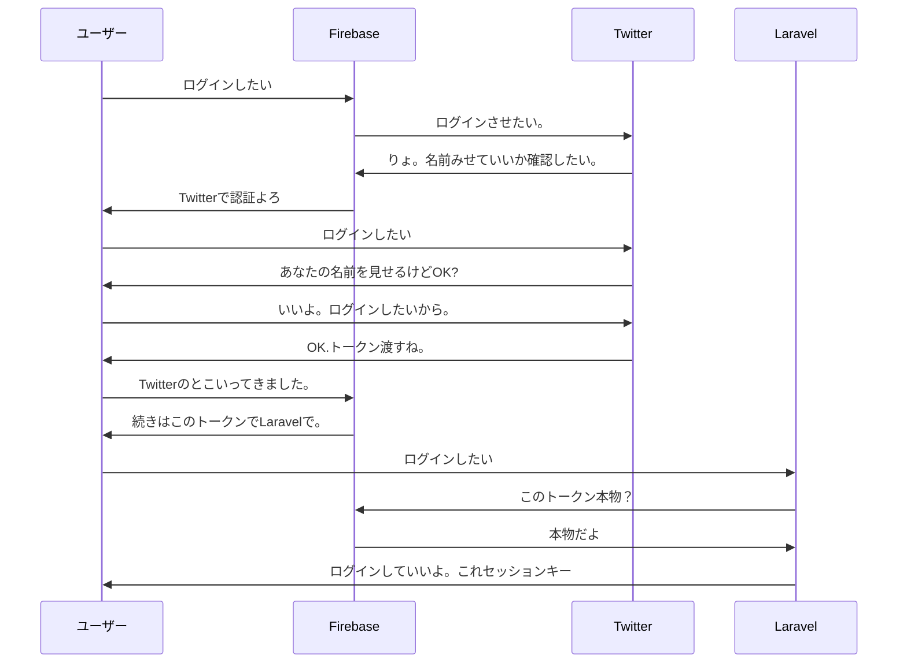

## 認証イメージ



## 認証

秘密鍵の登録


認証用のテーブル作成

```
php artisan make:migration create_users_table --create=users
```

編集し終わったら、マイグレーションでテーブルを作る。

laradock/.env を確認して、whitemap/.env に DB 設定を記述する。

```
DB_CONNECTION=mysql
DB_HOST=mysql
DB_PORT=3306
DB_DATABASE=<laradockで決めたもの>
DB_USERNAME=<laradockで決めたもの>
DB_PASSWORD=<laradockで決めたもの>
```

### パスポートの導入

```
composer require laravel/passport
```

```
$ composer require laravel/passport
$ php artisan migrate
$ php artisan passport:install
```

#### 試す

```
php artisan make:controller User --api
```

この時点のソース。
a1700f0e6b35a5892851626b23fcde8826b03a12

## 認証・認可

[面倒なログイン機能の実装は Firebase Authentication に丸投げしよう](https://www.apps-gcp.com/firebase-authentication/)
[firebase ui](https://github.com/firebase/firebaseui-web)
[Guard](https://qiita.com/fagai/items/a70c937ab7cf72f19dc2)
[【PHP】新 TwitterOAuth でログイン機能を実装する](https://qiita.com/sofpyon/items/982fe3a9ccebd8702867)
[Firebase Admin SDK for PHP Authentication](https://firebase-php.readthedocs.io/en/latest/authentication.html)
[Laravel のログイン認証の基本(Authentication)を完全理解する](https://reffect.co.jp/laravel/laravel-authentication-understand)
[Laravel 5.7 でプレーンなパスワード認証を行う](http://spacetimebubble.net/blog/2018/12/11/laravel-5-7%E3%81%A7%E3%83%97%E3%83%AC%E3%83%BC%E3%83%B3%E3%81%AA%E3%83%91%E3%82%B9%E3%83%AF%E3%83%BC%E3%83%89%E8%AA%8D%E8%A8%BC%E3%82%92%E8%A1%8C%E3%81%86/)
[既存の user マイグレーションファイルを書き換えてみた](http://raichel.hatenablog.com/entry/2015/02/15/170639)
