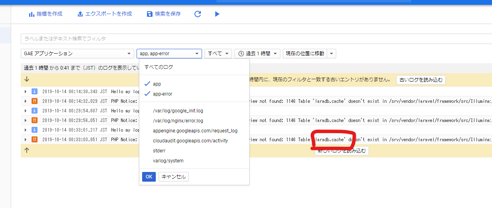

## ロギング

gcp_mysql.md で、DB への接続は確認できたが、認証で 500 エラーとなっている。
何のエラーか出ていないので、困る。
ので、さっさと Logging のサンプルもこなす。

[app/Logging/CreateStackdriverLogger.php](https://github.com/GoogleCloudPlatform/php-docs-samples/blob/master/appengine/php72/laravel-framework/app/Logging/CreateStackdriverLogger.php)

```diff:config/logging.php
+        // Add the following lines to integrate with Stackdriver:
+        'stackdriver' => [
+            'driver' => 'custom',
+            'via' => App\Logging\CreateStackdriverLogger::class,
+            'level' => 'debug',
+        ],
    ],
];

```

```yaml:app.yaml
runtime: php72

env_variables:
  LOG_CHANNEL: stackdriver
```

[app/Exceptions/Handler.php](https://github.com/GoogleCloudPlatform/php-docs-samples/blob/master/appengine/php72/laravel-framework/app/Exceptions/Handler.php)

```diff:app/Exceptions/Handler.php
    public function report(Exception $exception)
    {
-        parent::report($exception);
+        if (isset($_SERVER['GAE_SERVICE'])) {
+            // Ensure Stackdriver is initialized and handle the exception
+            Bootstrap::init();
+            Bootstrap::exceptionHandler($exception);
+        } else {
+            parent::report($exception);
+        }
    }
    # [END
```

### composer が入っていなかった。

```
composer require google/cloud-logging google/cloud-error-reporting
```

### Firebase のシークレットファイルの場所を追記。

```
env_variables:
  FIREBASE_CREDENTIALS: secret.json
```

### cache がないっぽい。



```
php artisan cache:table
```

## 参考

[Logging](https://cloud.google.com/community/tutorials/run-laravel-on-appengine-standard)
[PHP 用 Error Reporting の設定](https://cloud.google.com/error-reporting/docs/setup/php)
