# laravel sonarqube

## 必要な Dockerfile

- postgres
- sonarqube

## .env

.env を修正. sonarqube

```conf
### SONARQUBE ################################################
## docker-compose up -d sonarqube
## (If you encounter a database error)
## docker-compose exec --user=root postgres
## source docker-entrypoint-initdb.d/init_sonarqube_db.sh
## (If you encounter logs error)
## docker-compose run --user=root --rm sonarqube chown sonarqube:sonarqube /opt/sonarqube/logs

SONARQUBE_HOSTNAME=127.0.0.1
SONARQUBE_PORT=9000
SONARQUBE_POSTGRES_INIT=true
SONARQUBE_POSTGRES_HOST=postgres
SONARQUBE_POSTGRES_DB=sonar
SONARQUBE_POSTGRES_USER=sonar
SONARQUBE_POSTGRES_PASSWORD=sonarPass
```

.laradock/data/配下に置くように変更

```diff
- DATA_PATH_HOST=~/.laradock/data
+ DATA_PATH_HOST=./.laradock/data
```

## ファイルのパーミション

```
2019-10-19 01:53:08,586 main ERROR Unable to create file /opt/sonarqube/logs/es.log java.io.IOException: Permission denied
```

```
sudo mkdir -p ~/.laradock/data/sonarqube/logs
sudo chmod -R 777 ~/.laradock/data/sonarqube
```

上記で成功。。。

## データベースを設定

```
docker-compose up -d sonarqube
## (If you encounter a database error)
## docker-compose exec --user=root postgres
## source docker-entrypoint-initdb.d/init_sonarqube_db.sh
```

のように書かれている。
[ボリュームにデータを永続化した場合、/docker-entrypoint-initdb.d のスクリプトはコンテナ起動ごとに実行されない](https://qiita.com/kimullaa/items/70eaec61c02d2513e76c)とあるように、
永続化されないのが問題のようだ。

ところが、`docker-compose up -d sonarqube`を実行するとコンテナがエラーで落ちてしまっていて、
`exec`で実行中のコンテナにログインできない。

```diff
  postgres:
    build: ./postgres
    volumes:
+ #      - ${DATA_PATH_HOST}/postgres:/var/lib/postgresql/data
      - ${POSTGRES_ENTRYPOINT_INITDB}:/docker-entrypoint-initdb.d
```

ボリュームを保存しようとしているところをコメントアウトすると、正常に動いたので、どうやらここがエラーのポイントの模様。

```diff
- #      - ${DATA_PATH_HOST}/postgres:/var/lib/postgresql/data
+       - /postgres:/var/lib/postgresql/data
```

ボリュームを保存するフォルダを ubuntu の直下のフォルダに指定したところ、動作に成功した。

## .env をもとに戻す

windows との相性がわるいので、 ~/.laradock/data/配下に置くように変更

```diff
- DATA_PATH_HOST=./.laradock/data
+ DATA_PATH_HOST=~/.laradock/data
```

... これでも動かない。
ただ、以下の作業はできるようになった。

```
docker-compose exec --user=root postgres
source docker-entrypoint-initdb.d/init_sonarqube_db.sh
```

しかし、以下のように言われてしまうのでこれも問題の模様。

```
ERROR:  role "sonar" already exists
```

動かなかったときに、うかつに共用フォルダ以下にデータ置き場を作ってしまったのが問題であった。
初回に設定不足で DB の init が動かなかった場合については、
`sudo rm -rf ~/.laradock/data/postgres`で解決を試すべきだった。
以下のように、データボリュームを使ったがこれもだめ。

```
   - postgresData:/var/lib/postgresql/data

volumes:
  postgresData:
```

いったん、DB の永続化はなしで試してみる。

## 仮想メモリを増やす

メモリを確認

```
sysctl vm.max_map_count
```

- sonarqube は内部で ElasticSearch を使用しているため、メモリを大量に使う。

```
sudo sysctl -w vm.max_map_count=262144
```

上記で足りなかった。。わけではなかった。別のエラー。

```
sudo sysctl -w vm.max_map_count=524288
```

## ログの設定

- これは効かなかった。

```
docker-compose run --user=root --rm sonarqube chown sonarqube:sonarqube /opt/sonarqube/logs
```

## ログイン


ユーザ:admin,パスワード:admin でログイン

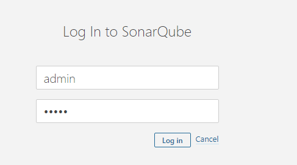

プロジェクトの作成

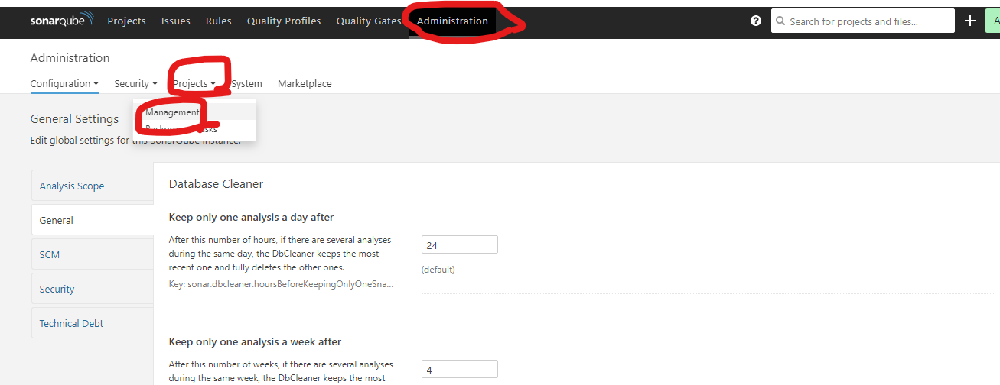
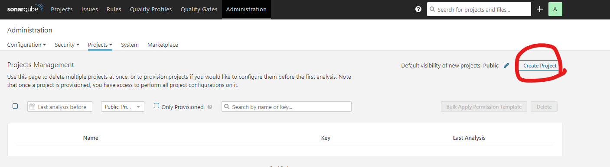
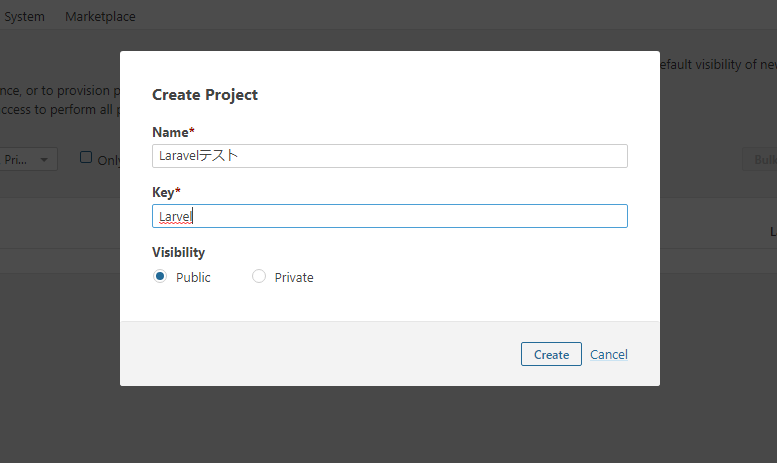
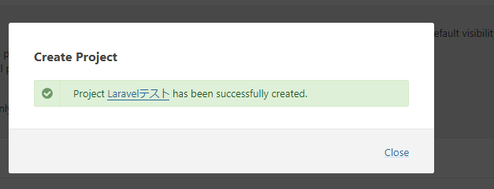
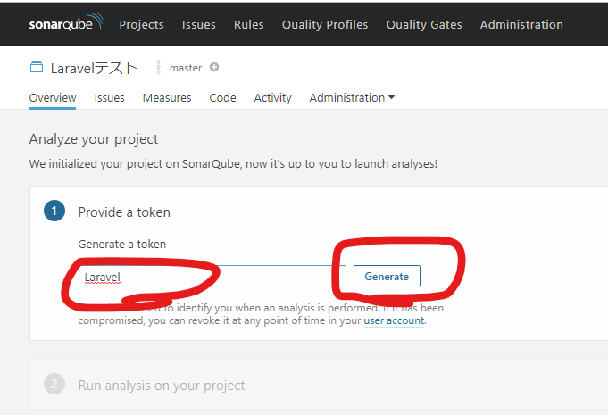

作成されたキーを保存しておく。
continue を押して続き。

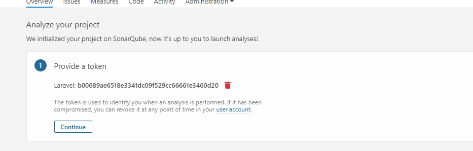

今回は PHP のため Other を選択


ここはよくわからないがとりあえず virtual の ubuntu を動かしているので
linux を選択
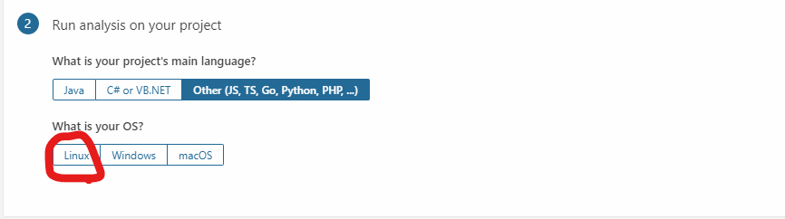
[ダウロードしろ](https://docs.sonarqube.org/latest/analysis/scan/sonarscanner/)って言われた。

```
mkdir -p /home/vagrant/sonarqube
cd /home/vagrant/sonarqube
sudo wget https://binaries.sonarsource.com/Distribution/sonar-scanner-cli/sonar-scanner-cli-4.2.0.1873-linux.zip
```

```
sudo apt install -y unzip
sudo unzip sonar-scanner-cli-4.2.0.1873-linux.zip
export PATH="$PATH:/home/vagrant/sonarqube/sonar-scanner-4.2.0.1873-linux/bin"
```

確認

```
cd /vagrant/project/whitemap/laravel_docker/whitemap/app
sonar-scanner \
  -Dsonar.projectKey=Larvel \
  -Dsonar.sources=. \
  -Dsonar.host.url=http://192.168.50.10:9000 \
  -Dsonar.login=b00689ae6518e3341dc09f529cc66661e3460d20
```

怒られた。プラグインが入っていない模様。

```
ERROR: Error during SonarQube Scanner execution
ERROR: No quality profiles have been found, you probably don't have any language plugin installed.
ERROR:
ERROR: Re-run SonarQube Scanner using the -X switch to enable full debug logging.
```

### プラグインを入れる

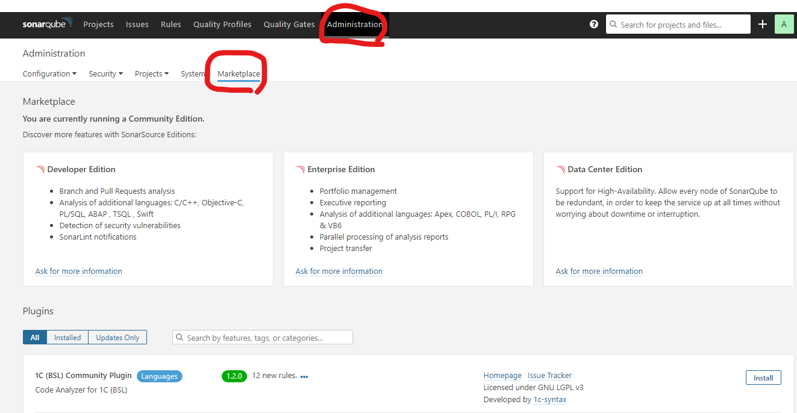
php で検索してインストール
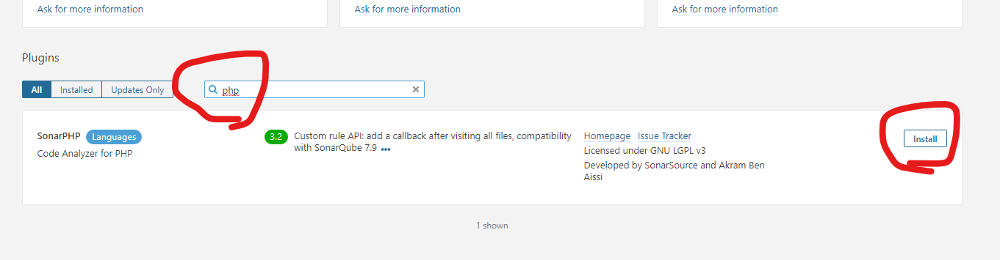
再起動する
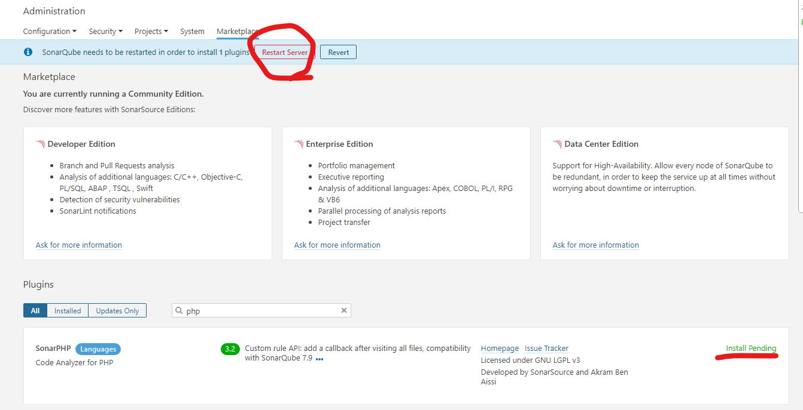

```
sonar-scanner \
  -Dsonar.projectKey=Larvel \
  -Dsonar.sources=. \
  -Dsonar.host.url=http://192.168.50.10:9000 \
  -Dsonar.login=b00689ae6518e3341dc09f529cc66661e3460d20
```

成功？

```
INFO: ------------------------------------------------------------------------
INFO: EXECUTION SUCCESS
INFO: ------------------------------------------------------------------------
INFO: Total time: 8.460s
INFO: Final Memory: 6M/24M
INFO: ------------------------------------------------------------------------
```

ログインをする。
プロジェクトを開くと、結果が！

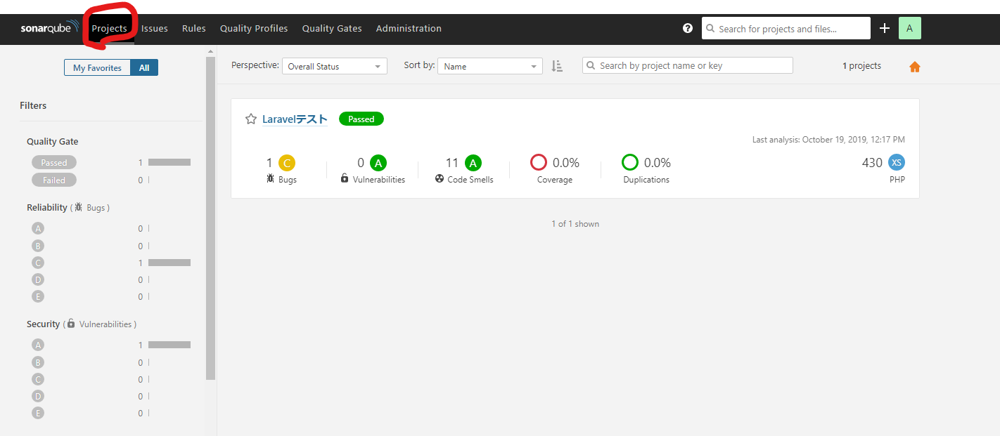

バグが一つあるもよう。

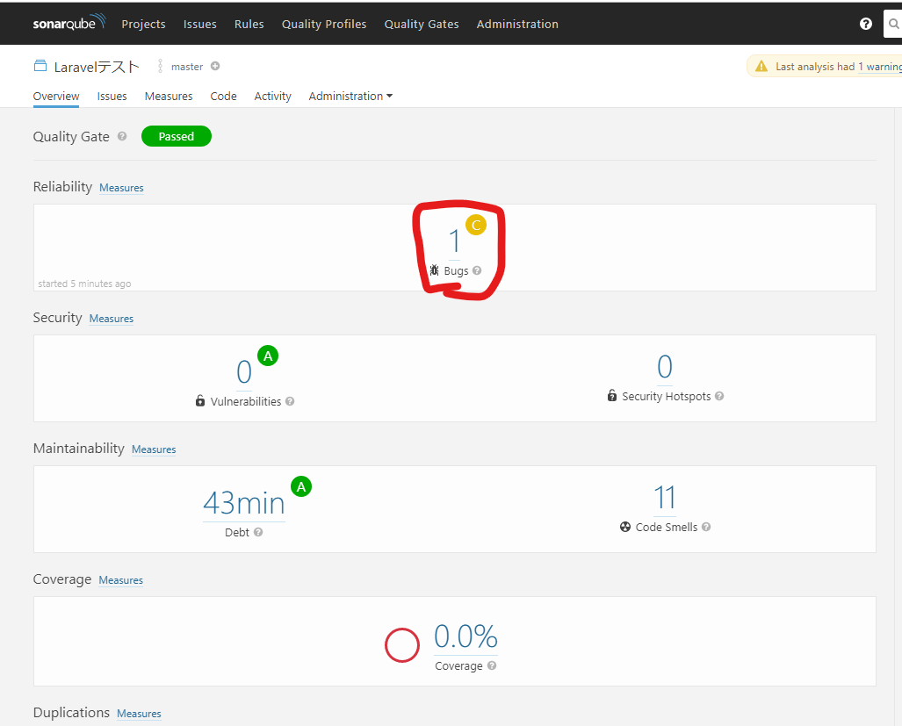
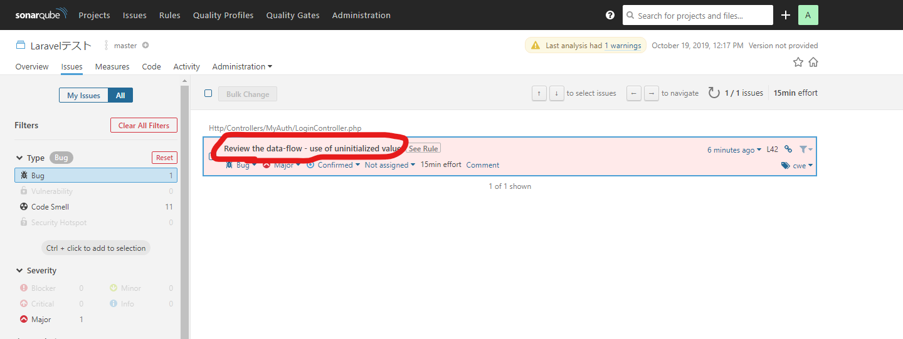
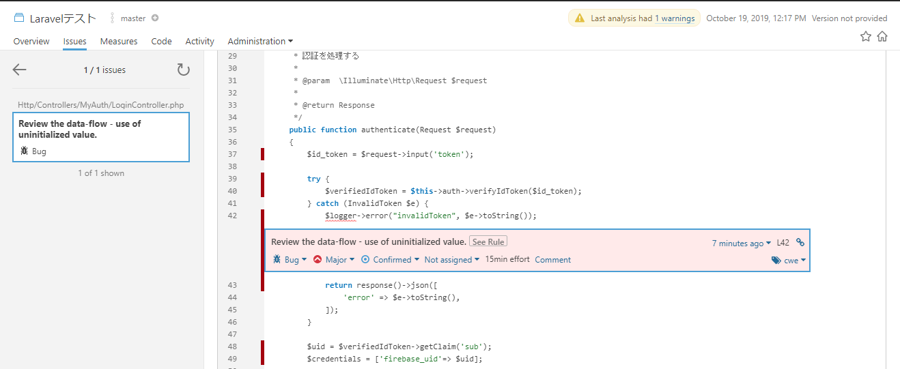

## 参考

[Laradock 3](https://laradock.io/documentation/#install-sonarqube-automatic-code-review-tool)
[issue](https://github.com/SonarSource/docker-sonarqube/issues/282#issuecomment-507735864)
[仮想メモリ - Elasticsearch 導入前に気を付けておきたいこと！](https://qiita.com/uzresk/items/e0b10c14875b79c450f2#%E4%BB%AE%E6%83%B3%E3%83%A1%E3%83%A2%E3%83%AA)
[Docker for Windows で postgres コンテナの Volume マウントを安全にする](https://qiita.com/megmogmog1965/items/e7cd4500006c3b6b1894)]
[SonarQube で PHP のコードを静的解析する](https://qiita.com/kadoyau/items/70f4a403b42847e4ed00)
[Get Started in Two Minutes Guide](https://docs.sonarqube.org/latest/setup/get-started-2-minutes/)
[Jenkins + SonarQube で PHP コードメトリクス計測！](http://kenzo0107.hatenablog.com/entry/2016/05/21/010902)
[Ubuntu の PATH の設定方法 j](https://qiita.com/takanemu/items/6027291be8a2a6af9adc)
[docker volume mount 時の user owner 問題](https://qiita.com/hikaruna/items/e04371fd49da0338ad81)
