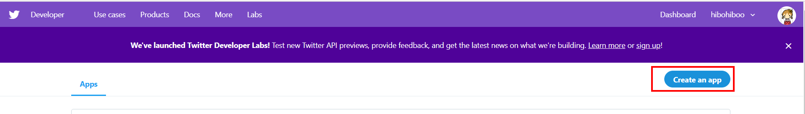
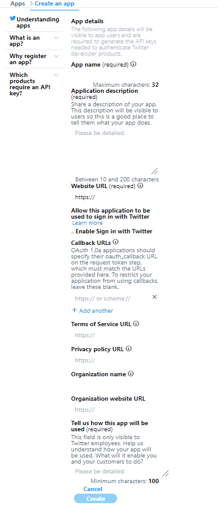
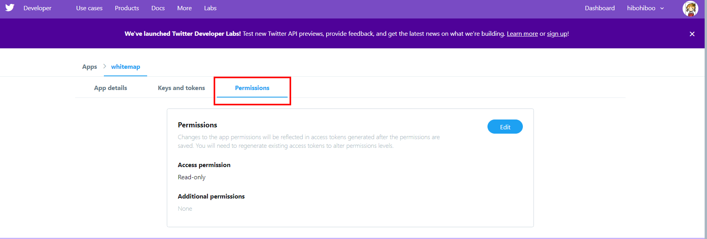

# Twitter 認証で FirebaseAuth をして Laravel の Token 認証を行う。

## twitter 開発環境の用意。

[Twitter 開発者登録に使う英語例文集](https://note.mu/mogya/n/nbd9a720f8a5b)を参考に、Twitter 社へ申請。

```
# The core use case, intent, or business purpose for your use of the Twitter APIs
I want to use Twitter's API to authenticate users in my application.
My application is the website to create charactersheet for Table Talk RPG.

# If you intend to analyze Tweets, Twitter users, or their content, share details about the analyses you plan to conduct and the methods or techniques
No, I have no plan to analyze Tweets at all.

# If your use involves Tweeting, Retweeting, or liking content, share how you will interact with Twitter users or their content
No. A User can tweet own charactersheet. However, My application doesn't use Twitter API to do this. I just add the "tweet" button on my site.


# If you’ll display Twitter content off of Twitter, explain how and where Tweets and Twitter content will be displayed to users of your product or service, including whether Tweets and Twitter content will be displayed at row level or aggregated
I have no plan to display Twitter data on my site or outside of twitter. I use Twitter API to authenticate users.
```

## App の作成



i のついているところは必須項目なので埋める



アクセス権限を Read-only にする。


