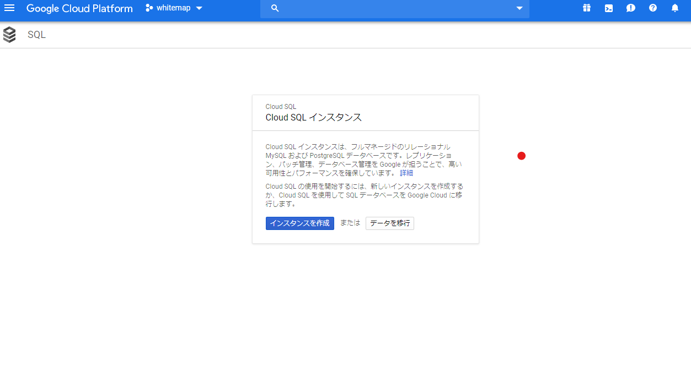
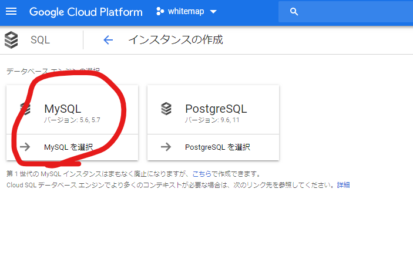
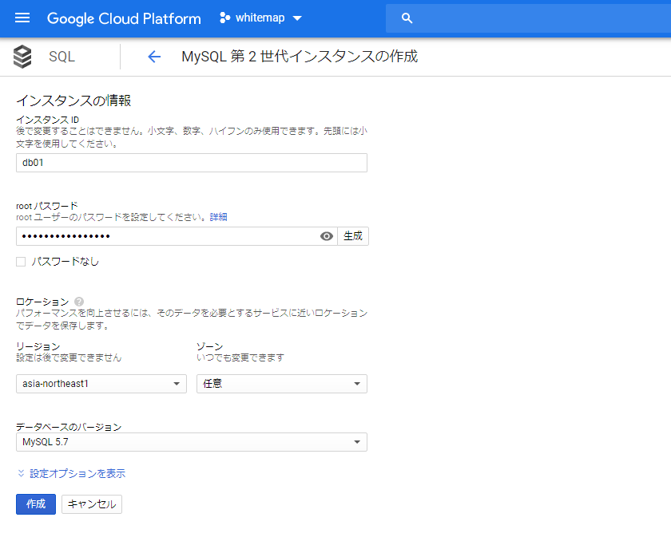
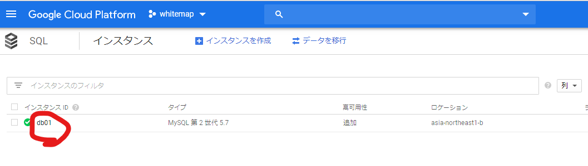
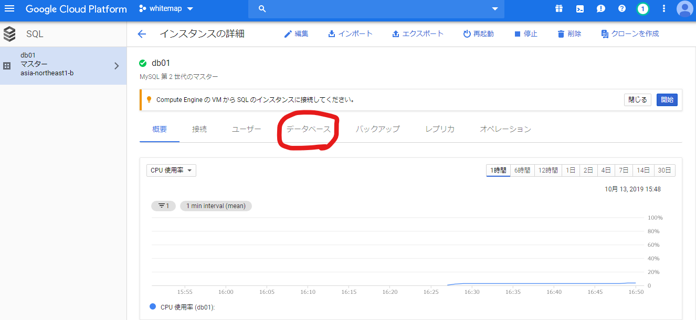
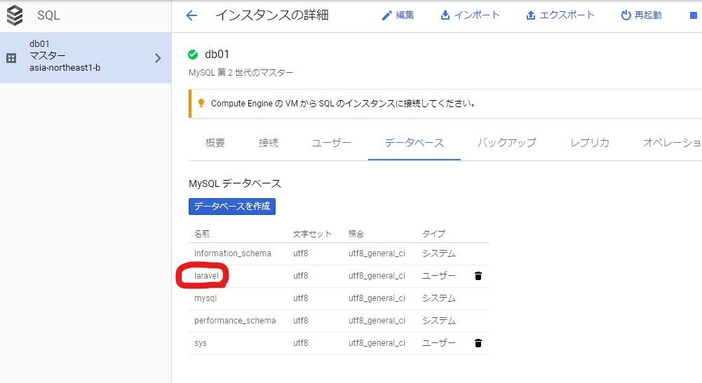

## MySQL インスタンスの作成

- インスタンスを作成
  

- MySQL を選択
  

* 名前を入力。
  - インスタンス名には機密情報や個人を特定できる情報を含めない。
    - インスタンス名は外部から閲覧可能。
  - インスタンス名にプロジェクト ID を含める必要はない。
    - この処理は必要に応じて自動的に行う（ログファイルの場合など）
* リージョンを入力
  - インスタンスと同じリージョンにすること
    - asia-northeast1 (東京))
  - ゾーンは任意のままでよい
    

### gcloud に接続

```
./bin/gcp_bash.sh
gcloud auth login
gcloud sql instances describe インスタンス名 | grep connectionName
```

`connectionName: プロジェクトID:asia-northeast1:インスタンス名`が返される。`プロジェクトID:asia-northeast1:インスタンス名`が接続文字列となる。

#### バックグラウンドでプロキシを動かす

末尾に&をつけて、バックグラウンドで動かす。
実行した後、Enter を押さないと止まったように見える。

```
cloud_sql_proxy -instances=プロジェクトID:asia-northeast1:インスタンス名=tcp:3306 &
```

#### MySQL に接続してインスタンスを作る

```
gcloud sql databases create laravel --instance=インスタンス名
```

プラットフォームから確認する。





#### テーブルの作成

```
php artisan session:table
export DB_DATABASE=laravel DB_USERNAME=root DB_PASSWORD=YOUR_DB_PASSWORD
php artisan migrate --force
```

#### 接続ユーザの作成

```
gcloud sql users create [USER_NAME] --host=[HOST] --instance=[INSTANCE_NAME] --password=[PASSWORD]
```

#### 設定ファイルの修正

```
runtime: php72

env_variables:
  APP_KEY: YOUR_APP_KEY
  APP_STORAGE: /tmp
  VIEW_COMPILED_PATH: /tmp
  CACHE_DRIVER: database
  SESSION_DRIVER: database
  ## Set these environment variables according to your CloudSQL configuration.
  DB_DATABASE: YOUR_DB_DATABASE
  DB_USERNAME: YOUR_DB_USERNAME
  DB_PASSWORD: YOUR_DB_PASSWORD
  DB_SOCKET: "/cloudsql/YOUR_CONNECTION_NAME"
  APP_LOG: errorlog
```

## 参考

[Run Laravel on Google App Engine standard environment](https://cloud.google.com/community/tutorials/run-laravel-on-appengine-standard)
[Google App Engine で Laravel を動かして Cloud SQL へ接続してみた](https://memento-mori.jp/blog/back-end/google-app-engine_on_laravel)
[Cloud SQL for MySQL インスタンス](https://cloud.google.com/sql/docs/mysql/create-instance)
[【Docker】AlpineLinux を使った Laravel 環境構築](https://qiita.com/gatapon/items/cfdceedee29570185325)
[Cloud SQL for MySQL ユーザ作成](https://cloud.google.com/sql/docs/mysql/create-manage-users?hl=ja)
